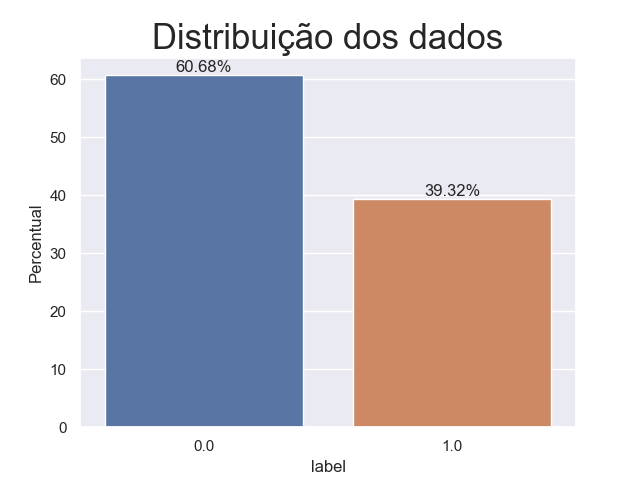
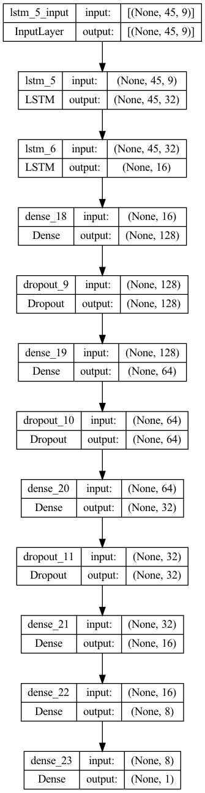

<!-- antes de enviar a versão final, solicitamos que todos os comentários, colocados para orientação ao aluno, sejam removidos do arquivo -->
# Classificação de Ações com Redes Neurais

#### Aluno: [Ricardo Monteiro](https://github.com/ragmonteiro)
#### Orientador: [Felipe Borges](https://github.com/FelipeBorgesC)

---

Trabalho apresentado ao curso [BI MASTER](https://ica.puc-rio.ai/bi-master) como pré-requisito para conclusão de curso e obtenção de crédito na disciplina "Projetos de Sistemas Inteligentes de Apoio à Decisão".

<!-- para os links a seguir, caso os arquivos estejam no mesmo repositório que este README, não há necessidade de incluir o link completo: basta incluir o nome do arquivo, com extensão, que o GitHub completa o link corretamente -->
- [Link para o código](https://github.com/link_do_repositorio). <!-- caso não aplicável, remover esta linha -->

### Resumo

Identificar ações que irão se valorizar é um dos maiores desafios de gestores de fundos de ações e investidores em renda variável, principalmente se o objetivo do investidor é o curto prazo (operações com menos de 1 mês de duração), onde a análise dos dados financeiros da empresa (Análise Fundamentalista) não é eficiente. Atualmente, uma das ferramenta mais utilizada por investidores que desejam realizar operações por períodos mais curtos (swing trade) é a Análise Técninca, que utiliza indicadores baseados no histórico de preços de negociação e volumes transacionados para buscar sianis de compra/venda das ações. Esta ferramente vem sendo utilizada a anos por investidores de todos os tipos, de institucionais à pessoas físicas, e é bastante eficiente, quando usado de forma adequada.

Nos últimos anos, com o avanço das técnincas de Machine Learning, Deep Learning e Data Mining, diversos modelos foram criadas para tentar prever o comportamento de uma ação ao longo do tempo, porém devido ao comportamento histocástico do preço dos ativos e da quantidade de fatores podem influenciá-lo, esses modelos, normalmente, não apresentam uma boa performance ao longo do tempo.

Levando consideração a dificudade em se prever o preço futuro das ações, este trabalho tem como objetivo testar uma abordagem não tradicional para selecionar ativos para uma carteira de investimento, ao invés de simplesmente usar modelos de previsão de séries temporais para estimar o preço da ação, a seleção dos ativos será feita através de uma classificação binária, onde o label de cada registro será definido de acordo com o seguinte critério:

* Verdadeiro (label 1) - ativos que vão se valorizar mais do que X% em um período de Y dias
* False (label 0) - ativos que vão se valorizar menos do que %X no período definido

O objetivo desta abordagem é tentar simplificar o problema, que passa de uma previsão de séries temporais para uma classificação binária.

### 1. Introdução

Este trabalho tem com objetivo identificar ações que vão se valorizar mais do que X% em Y dias, onde X e Y são parâmetros definidos no momento da extração dos dados que serão usados para realizar o treinamento do modelo. Para realizar esta classificação serão usados dois tipos de informação:
1. A série histórica de preços de negociação dos ativos na B3 e indicadores técnicos (série temporal)
2. Sinais de negociação, que nada mais são eventos que eventos que, em estratégias de negociação automatizadas disparam uma compra ou venda de um ativo. Por exemplo, o cruzamento de duas médias móveis.

Para garantir que apenas ativos com boa liquidez (ativos com bom volume de negócios diário) sejam utilizados no modelo, somente ações que atenderem aos critérios descritos abaxo serão considerados:
1. Que tenham sido negociadas em todos os pregões no último ano
2. Que tenham volume médio diário de negociação de, pelo menos, R$ 200.000
3. Somente operações realizadas nos últimos 10 anos serão consideradas
Este critério de seleção foi adotado pois, ativos de baixa liquidez podem sefrer alta variação no preço (alta volatilidade) devido a poucas operações, o que aumenta seu risco e além disso, como o objetivo do modelo é encontrar ativos para operações de curto prazo, é fundamental que que exista liquidez no mercado para permitir a entrada e saida da operação com facilidade, o que pode não ocorrer em ativos de baixa liquidez.

Os dados foram extraídos de uma base de dados PostgresSQL que é carregada diariamente a partir de processos que "varrem" diversas fontes públicas na web (web scraping), como o site da B3, Banco Central do Brasil, ADVFN, entre outras. Além do hitórico de preço dos ativos, esta base contém informações sobre emissores dos ativos e dados macroeconomicas como série histórica da cotação do dólar, inflação, taxas de juros, etc. Todos estes dados podem ser usados como features para o modelo.

Para o cálculo dos indicadores técnicos será utilizada a Biblioteca [TA-LIB em Python](https://github.com/TA-Lib/ta-lib-python), que inclui funções para calcular maos de 150 indicadores técnincos, além de identificar diversos padrões de Candlesticks.

Com o objetivo de automatizar a geração de features e permitir o teste de modelos com diferentes conjuntos de dados, foi criada uma biblioteca que, além de extrair os dados do banco relacional, permite calcular os indicadores técnicos através da configiração de um arquivo JSON, desta forma não é necessário alterar o código fonte para realizar experimentos com diferentes conjuntos de dados, basta alterar um arquivo de configuração e executar o código novamente. Para mais detalhes sobre como criar o JSON de configuração para gerar as bases de treinamento e validação podem ser encontrados no [Apendice I](#apendice).

É importante ressaltar, que por se tratar de um problema extremamente complexo, este trabalho não tem como objetivo desenvolver um modelo que possa ser usado no mercado para realizar operações reais. O objetivo é testar uma abordagem não tradicional para seleção de ações de uma carteira de investimento e que a combinação de séries temporais com sinais de negociação preduzem resultados melhores do que apenas as séries temporais.

Para comprovar esta teoria, este trabalho vai comprar o resultado obtidos por dois modelos:
1. Uma rede LSTM que receberá apenas a serie histórica de preços dos ativos e seus respectivos indicadores técnicos e terá como saída a probablidade do ativo apresentar rentabilidade suerior a X% em Y dias
2. Uma rede neural que terá duas entradas diferentes:
    * A série istórica de preço dos ativos e seus respectivos indicadores técncos
    * Um conjunto de sinais de negociação (features não temporais)
O resultado desta duas redes seraão concatenadas e a saída deste modelo será a probabilidade de ativo apresentar rentabilidade suerior a X% em Y dias.

### 2. Modelagem
A implementação do modelo foi dividida em 3 etapas:
1. Extração e preparação dos dados,
2. Treinamento,
3. Cálculos das métricas para avaliação do modelo.
#### 2.1 Extração e preparação dos dados
Nesta primeira etapa é reralizada uma consulta à base de dados PostgresSQL para extrair os as séries históricas de preço dos ativos que atendem aos seguintes critérios:
1. Que tenham sido negociadas em todos os pregões no último ano
2. Que tenham volume médio diário de negociação de, pelo menos, R$ 200.000
3. Somente operações realizadas nos últimos 10 anos serão consideradas
As seguintes informações são retornadas para cada uma das ações:
* Código de negociação do ativo na B3 (Ticker)
* Preço de abertura da ação
* Preço de Fechamento da ação
* Valor máximo alcançado pela ação no dia
* Valor mínimo alcançado pela ação no dia
* Classificação do mercado do emissor
* Classificação setorial do emissor da ação definida pela B3 (setor econômico, subsetor e segmento) 

Para facilitar o processamento das informações e permitir que o cálculo dos indicores possa ocorrer em paralelo, os dados extraídos do base de dados são gravados em um diretório em formato parquet. É gerado um arquivo para cada ação contendo todo o histórico de preço de ativo. Uma vez que os arquivos tenham sido gerados, uma segunda função irá processá-los para gerar os indicadores técnicos, este processo irá ler os arquivos, o arquivo de configuração <b>config.json</b>, calcular todos os indicadores técnicos e sinais de negociação configurados, fazer o pré-processamento das features e gerar um novo arquivo parquet para cada ativo. O pré-processamento das features inclui, one-hot encoding de variáveis categóricas e "scaling" das variáveis numéricas. O arquivo parquet gerado contém as seguintes colunas:
* Ticker
* Data de início da série temporal do registro
* Data de término da série temporal do registro
* Formato da sére temporal armazenada
* Série temporal de preço e indicadores
* Colunas com os sinais de negociação 

As colunas Data de início e término da série temporal, foram incluídias no arquivo apenas como referência e para facilitar a validação dos dados, elas não são usadas no modelo. O Formato da série temporal (shape), foi criado devido a uma restrição do arquivo parquet, que não permite a gavação de matrizes multidimensionais, apenas vetores podem ser gravados neste formato. Por este motivo, antes de persistir os dados do ativo no arquivo a API verifica o formato dos dados da série histórica (shape da matriz), transforma a matriz em um vetor (flatten) e grava o arquivo. O formato da série temporal será usado para reconstruir a matriz antes de passá-la para a rede neural LSTM.

Para a seleção dos sinais de negociação, foi feito o treinamento de um modelo XGBoost e gerada uma tabale ordenada de acordo com a importância das features, as colunas melhor ranqueadas foram utilizadas no processo de treinamento. Alguns dos sninais de negociação utilizados no processe de treinamento são:
* Volatilidade do preço de fechamento - é uma medida de risco e é calculada através do desvio padrão do retorno diário do ativo.
* Coeficiente angular da volatidade - a idéia desta feature é passar para o modelo uma ideia da tendência da volatilidade (alta, queda ou estabilidade) no período em que o experimento está sendo realizado (parâmetro historic_period). Ela é obtida através da regressão linear da volatilidade.
* Coeficiente angular da variação do volume negociado - em análise técnica o volme de negociação do ativo é usado para confimrar tendências de preço, espera-se que uma tendência de alta no preço de um ativo seja associada à um aumento em seu volume de negociação.
* Distância entre o preço de fechamento e os "Pivot Levels" - "Pivot Levels" são zonas de preço consideradas como suporte/resistência, ou seja são regiões onde o preço de um ativo pode encontrar resistência em seguir em sua tenência de alta ou de queda.
* Distância entre a linha do RSI e o threshold 70 - o RSI (Relative Stringht Index) é um indicador técnico de momentum que tem como objetivo medir a capacidade de um ativo de seguir em sua tendência. Valores acima de 70 classificam o ativo como "sobre comprado", ou seja, o valor do ativo chegou a um patamar em que provavelmente haverá uma correção no preço.
* Candlesticks - são padrões de comportamento do preço do ativo que geram sinais de compra e venda. São muito utilizados em análise técnica, normalmente associados à outros indicadores.

Esta metodologia, de se treinar um modelo baseado em árvores de decisão e listar as features por ordem de importância, pode ser usada sempre que se deseje testar um novo sinal de negociação, desta forma é possível ter um bom indicativo que a nova feature realmente irá agregar valor ao modelo.

Para este experimento os seguintes parâmetros foram definidos no arquivos de configuração:

* historic_period = 45
* profit_period = 10 pregões (dias em que houve negociação do ativo)
* stride = 5
* profit = 0.02

Isso significa que que os modelos serão treinados com um histórico de preço e indicadores técnicos de 45 dias e a rentabilidade usada para gerar o label será aferida 10 dias após o último dia da série temporal. Os ativos que apresentarem rentabilidade igual ou superior a 2% em 10 dias, será classificada como 1 e os demas registros como 0. Além disso, haverá um intervalo de 5 dias entre cada linha do conjusto de dados usado no treinamento, ou seja se o primeiro registro usado no treinamento contém dados até o dia 10 de janeiro, o segundo registro conterá dados a partir do dia 15 de janeiro. 

Pelo gráfico abaixo é possível notar que q base de treinamento não é perfeitamente balanceada, mas não será feito nenhum tratamento especial para tratar o desbalanceamento, pois a proporção de calsses positivas (1) e negativas (0) não é tão grade.

    

O último passo da etapa de extração e preparação dos dados e criação da base de treino e teste. Nesta etapa todos os arquivos são concatenados, seus registros misturados e dois arquivos são gerados: um contendo a base de treinamnto (aproximadamente 80% dos registros) e outro com os dados de teste. Uma detalhe importante é que a base de treinamento/teste contempla o histório de preços até dezembro de 2022, os dados de 2023 serão usados para validar os resultados obtidos durante o treinamento/teste do modelo.

#### 2.1 Treinamento

Dois modelos foram treinados:

1. Uma Rede LSTM, que recebe apenas os dados históricos de preço. Esta rede é composta por X camadas LSTM sguidas de camadas full connected e gera como saída apenas um neurônio que contêm a probabiliade da ação apresentar valorização superior a 2% em 10 dias. A imagem abaixo apresenta a arquitetura utilizada nesta rede neural
 

    

2. Uma rede com arquitetura composta por duas entradas:
    a. A primeira, que trata os dados da série histórica, é composta por duas camadas LSTM.
    b. A Segunda, que trata os sinais de negociação, é composta por camadas Full Connected.
   As duas redes são conectadas, e seguem por uma rede full connected que tem como saída um neurônio com a probabiliade da ação apresentar valorização superior a 2% em 10 dias.
 

    

Para efeito de comparação entre os dois modelos, os parâmetros de treinamento foram os mesmos:

 * Loss Function: binary crossentropy
 * Otimizaror: Adam com learnig rate de 0.002
 * Métrica de avaliação do modelo: AUC
 * Épocas máximas: 200
 * Batch Size: 64

Alem disso, com o objetivo de reduzir a chance de overfit o modelo, foi adicionado o "callback" EarlyStopping que irá interromper o treinamento caso o AUC não apresente melhora por 20 épocas seguidas.

#### 2.3 Cálculos das métricas para avaliação do modelo.

A comparação dos modelos será feira através das seguintes métricas:
* Matriz de confusão
* Precision
* Recall
* F1 Score
* Acurácia

### 3. Resultados

No quadro abaixo é possível comprar os resultados durante o treinamento dos dois modelos:

Indicador          | LSTM Simples       | Rede Neural com Arquitetura customizada
------------------ |------------------- | ---------------------------------------
Acurácia           |  62%               | 62%
Matriz de Confusão |  [5755  171]  [3562  278] | [5384  542]  [3213  627]
Precision          |  62%               | 54%
Recall             |  7%                | 16%
F1 Score           |  13%               | 25%

Apesar de ambos os modelos apresentarem a mesma acurácia de 62%, é possível notar que o modelo com a arquitetura customizada foi capaz de identificar mais do que duas vezes mais ativos que se valorizaram mais do que 2% em 10 dias, que é o objetivo do modelo. A melhor precision do modelo modelo LSTM se deve ao fato dele classificar a grande maioria dos registros como negativos (classe 0)identificando apenas 278 das mais de 3.500 classes positivas. A comparação do F1 Score comprova a melhor performance da Rede Neural com dois inputs, um para a série temporal e a segunda para os sinais de negociação.

### 4. Conclusões

Claramente o modelo com entradas separadas para as séries temporais e os sinais de negociação apresentou performance muito superior ao tradicional LSTM (F1 Score de 25% contra 13% do LSTM), porém esta performance ainda não é suficiente para que ele seja usado em negocições reais no mercado de capitais. De qualquer forma, o resultado encontrado confirma que vale a pena realizar novos experimentos para tentar melhorar a performance deste modelo, combinando mais indicadores técnicos, criando novos sinais de negociação ou mesmo utilizando outros tipos de informação, como dados macroeconômicos (variação do PIB, taxa de juros, variação cambial, onfiança do consumidor, etc). Além disso, a arquitetura de redes neurais permite a utilização de dados não estruturados como imagem e texto em conjunto com os dados estruturados, logo outro experimento possível seria gerar gráficos com o histórico de preço dos ativos e usar estas imagens como outra entrada para o modelo.

Outro exerimento possível seria utilizar arquiteturas de redes neurais mais sofisticadas, como Transformers, para tratar as séries temporais. A combinação do conjujto de features corretas com modelos mais sofisticados tem o potencial de gerar resultados bem mais interessantes do que os que foram obtidos neste trabalho, o que viabilizaria sua utilização no mercado real.

Uma vez que o modelo apresente indicadores melhores, é altamente recomendável testá-lo no mercado antes de realizar operações envolvendo dinheiro real. Estes testes podem ser facilmente realizados, montando uma carteira de ações baseada nos ativos indicados pelo modelo e comparando a performance desta carteira com índices amplos como o IBOVESPA.

Outra consideração importante é que este tipo de modelo precisa ser retreinado com uma certa frequência, pois as condições do mercado financeiro mudam a todo momento e por este motivo um modelo que funciona muito bem em um momento pode passar a performar de forma inaceitável muito rapidamente.

De uma forma geral, acredito que os resultados obtidos com este experimento comprovam que é possível utilizar redes neurais para classificar ações em lucrativas ou não que vale a pena realizar novos experimentos para melhorar os resultados obtidos. De acordo com pesquisas que fiz durante o desenvolvimento deste trabalho, pude observar que esta é uma área pouco explorada e parece haver muito espaço para utilização deste tipo de arquitetura nesta área, principalmente pela possibilidade de combinar dados estruturados com não estruturados.

### <a id="apendice">Apêndice I - Preparação dos datasets: O arquivo de configuração strategies.json</a>
A preparação dos dados consiste em incluir indicadores técnicos e outras features ao histórico de preço de cada ativo, de forma a enriquecer a base de treinamento e permitir que o modelo possa realizar uma melhor classificação. Com o objetivo de facilitar a geração dos datasets de treinamento e validação, ao invés de implementar a criação das features manuelmente em Python, foi criado um arquivo de configuração chamado <i>strategies.json</i> que permite configurar quais indicadores técnicos serão utilizados em cada dataset. Desta forma, é possível configurar diferentes conjustos de features e realizar vários experimentos com diferentes arquiteturas de modelos sem que seja necessário implmentar diferentes versões do código.

Com apenas um arquivo de configuração é possível gerar diversos conjuntos de dados, contendo diferentes combinações de indicadores técnicos e features calculadas. Cada conjunto de dados será gravado em um diretório diferente (<code>&lt;variável de ambiente DATASET_PATH&gt;/&lt;nome da estratégia&gt;</code>) no formato parquet. As features são agrupadas em <b>Estratégias de Negocição</b> e além dos indicadores técnicos é possível definir a quantidade de dias usadas na geração da série histórica (por exemplo, cada registro enviado para o modelo terá 30 dias de histórico de cotação), qual o período usado para calcular a rentabilidade do ativo (com base na rentabilidade do ativo, será definido o valor do label), o valor da rentabilidade de corte para geração do label (valors maiores ou igual 2% serão considerados 1 e abaixo deste valor 0) e a quantidade de dias que serão "pulados" entre as linhas do dataset (uma descrição detalhada de valor do arquivo de configuração é fornecida a seguir).

<code>
<pre>
    "&lt;nome da estrategia&gt;":{
        "description": "&lt;Descrição da estratégia&gt;",
        "historic_period": &lt;Número inteiro que irá definir o total dias usados pelo modelo. Por exemplo, o modelo receberá um histórico de preço de 
                            60 dias para classificar o ativo&gt;,
        "profit_period": &lt;Número inteiro que definirá o período usado para calcular a rentabilidade do ativo (será usado para definir seu label).
                          Por exemplo, o modelo reberá 60 dias de cotação para classificar o ativo, se este parâmetro for setado para 10, a rentablidade 
                          usada para definir o label será calclada como: 
                          preço 10 dias após a o último dia da série de entrada/preço do último dia da série de entrada - 1&gt;,
        "stride": &lt;Número inteiro que define quantos dias serão "pulados" durante a geração das series temporais de preços. Por exemplo, um modelo
                       poderá ser treinado com um histórico de preços de 30 dias, a primeira série histórica será do dia 01 até o dia 30 do mês, se
                       shift_days for igual a 5 dias, a segunda série será do dia 6 (cinco dias após o início da série anterior) até o dia 6 mais 30
                       dias&gt;,
        "profit": &lt;Rentabilidade usada para definir o label de classificação de cada registro enviado para o modelo durante o treinamento. Por exemplo,
                   Se o objetivo do modelo for identificar ativos que possuam rentabiliade superior a 5% em um período de 20 dias, o valor atribuído para
                   este parâmetro deve ser 0.05&gt;,
        "functions": { -- Lista de funções que fazem parte da estratégia de negociação
            "&lt;nome "fantasia" da função&gt;":{
                "function": "&lt;nome da função na biblioteca TA-Lib, será usado para chamar a função no código&gt;",
                "params":{ -- Lista de parâmetros da função (parâmetros relacionados ao preço do ativo não devem ser listados aqui)
                    "&lt;nome da parâmetro&gt;": &lt;valor&gt;
                }                
            }
        },
        "candles": [Lista de candlesticks que devem ser identificados na série temporal],
        "custom_columns":{ 
            -- Colunas customizadas são operações aritméticas que podem ser aplicadas aos indicadores técnicos com o objetivo de criar novas
            -- colunas que ajudem o modelo a melhorar sua performance. Por exemplo, ao invés de simplesmente adicionar uma média móvel ao 
            -- modelo, é possível adicionar a distância entre o preço de fechamento do ativo e a média móvel através de uma coluna customizada.
                "&lt;Nome da coluna&gt;": "&lt;Fórmula&gt;" -- Atualmente as operação permitidas são: +, -, * e /
            }
    }
</pre>
</code>

Exemplo de configuração:

Neste exemplo, a estratégia considera 90 dias de histórico de preço do ativo para classificar ativos que tenham rentabilidade superior a 5% em um período de 22 dias e para fazer isso, utiliza além do histórico de cotações os indicadores: Média móvel exponencial de 7 e 21 dias e o OBV.

<code>
<pre>
{
    "EMA_7_21_OBV":{
        "description": "Combinacao de 2 medias moveis (7 e 21 dias) e OBV ",
        "historic_period": 90,
        "profit_period": 22,
        "shift_days": 5,
        "profit": 0.05,
        "functions": {
            "EMA_7":{
                "function": "EMA",
                "params":{
                    "timeperiod": 7
                }
            },
            "EMA_21": {
                "function": "EMA",
                "params":{
                    "timeperiod": 21
                }            
            },
            "OBV":{
                "function": "OBV"                  
            }
        },
        "candles": ["CDLMORNINGSTAR", "CDLSHOOTINGSTAR", "CDLTAKURI"],
        "custom_columns":{
            "diff_ema_21_close": "[EMA_21] - [CLOSE]",
            "diff_ema_21_ema_7": "[EMA_21] - [EMA_7]"
        }
    }
}
</pre>
</code>
---

Matrícula: 202.100.417

Pontifícia Universidade Católica do Rio de Janeiro

Curso de Pós Graduação *Business Intelligence Master*
